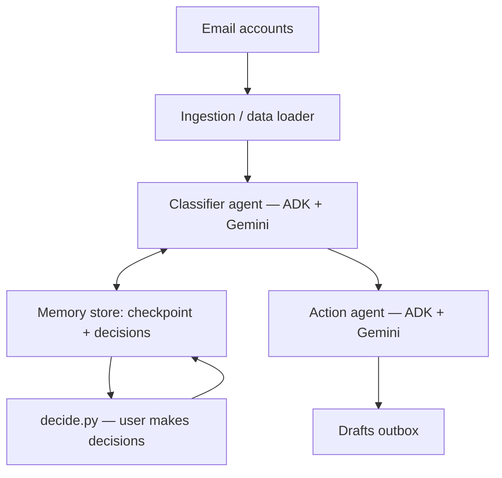

# Subscription Sweep — Inbox Intelligence Agent

An AI agent system that reads through a cluttered inbox, figures out what each
email actually is, remembers every decision you've ever made about it, and
drafts the follow-up action for you — so subscriptions stop getting forgotten,
real people stop waiting for replies, and good deals stop getting buried in
noise.

Built for the **AI Agents: Intensive Vibe Coding Capstone Project** (Concierge
Agents track).

## The problem

A typical inbox mixes everything together: recurring subscriptions you forgot
you're paying for, real discounts worth acting on, messages from actual people
waiting for a reply, and a wall of marketing noise drowning all of it out.
Sorting through this by hand is repetitive and easy to put off indefinitely —
which is exactly how subscriptions quietly keep renewing and replies quietly
never get sent.

## The solution

Two AI agents work together, built with Google's Agent Development Kit (ADK)
and Gemini:

- **The classifier agent** reads each email's subject and body and decides
  what it actually is — subscription, deal, a message needing a reply, a job
  application update, a ticket confirmation, a challenge invite, or noise to
  ignore.
- **The action agent** takes a category plus a decision you've made (cancel,
  keep, reply, ignore) and drafts the actual text — a polite cancellation
  request, a suggested reply, or a short note on why a deal is worth taking.

Sitting between them is a memory system that makes the agent genuinely useful
over time, not just a one-off classifier:

- It only ever looks at emails that arrived **since the last time it
  checked** (a checkpoint per account), so it never re-processes an entire
  inbox on every run.
- Every decision you make is saved permanently. Tell it once to cancel
  Netflix, and it never asks again — any future Netflix email is handled
  automatically.
- The same company in two different inboxes (e.g. a personal and a work
  account) is tracked as two separate decisions, so cancelling one never
  silently affects the other.
- Ignoring one message from a person does **not** silence all their future
  messages — each message is its own decision, since people send genuinely
  different things over time.

## Architecture



| Component | File | Role |
|---|---|---|
| Data loader | `data_loader.py` | Reads and normalizes emails from every connected account into one common format |
| State store | `state_store.py` | Persists checkpoints, saved decisions, the pending/waiting list, and generated drafts |
| Classifier agent | `ai_classifier.py` | ADK agent that reads an email and decides its category |
| Action agent | `action_agent.py` | Second ADK agent that drafts the actual cancellation/reply/deal text |
| Pipeline | `pipeline.py` | Orchestrates one full run: fetch new → classify → check memory → draft → save |
| Decision tool | `decide.py` | Simple CLI for the user to make decisions on pending items |
| Evaluation | `evaluate_classifier.py` | Tests classifier accuracy on a small labeled sample |

## Key hackathon concepts demonstrated

| Concept | Where |
|---|---|
| Agent / Multi-agent system (ADK) | `ai_classifier.py` and `action_agent.py` — two separate ADK agents working together |
| Security features | API key loaded from environment/`.env`, never hardcoded; action agent only ever drafts text, never sends anything automatically; safe fallback (`noise`) on any AI failure so the pipeline never crashes on bad input |
| Deployability | Stateless pipeline design with externalized config (API key, data folder) — suitable for containerizing and deploying to Cloud Run; no local-only dependencies |

## Setup

1. Install dependencies:
   ```
   pip install google-adk pydantic python-dotenv
   ```

2. Get a free Gemini API key from [Google AI Studio](https://aistudio.google.com/apikey).

3. Create a `.env` file in the project folder:
   ```
   GOOGLE_API_KEY=your-key-here
   ```

4. Make sure your `data/` folder contains the account email files (see
   `data/` for the format — each file represents one email account).

## Running it

```
python pipeline.py        # fetches new emails, classifies, applies known decisions
python decide.py          # make decisions on items in the waiting list
python pipeline.py        # re-run to see decisions applied and drafts created
```

To test without using any AI quota (fully offline, using known test labels):

```
$env:FORCE_TEST_MODE="true"     # PowerShell
python pipeline.py
```

To measure classifier accuracy on a small real-AI sample:

```
python evaluate_classifier.py
```

## Test results

On a 7-email sample spanning every category (noise, needs_reply,
job_application, ticket_purchase, subscription, deal, challenge), the real
ADK-based classifier scored **7/7 (100%)**.

## Project structure

```
inbox_agent/
  data/
    main_inbox.json
    work_inbox.json
    university_inbox.json
    signup_clutter_inbox.json
  data_loader.py
  state_store.py
  ai_classifier.py
  action_agent.py
  pipeline.py
  decide.py
  evaluate_classifier.py
  state/              (created automatically — checkpoint, decisions, pending, drafts)
```

## Future extensions

- Replace the local JSON files with a live Gmail connection via an MCP
  server, so the agent reads a real inbox instead of test data.
- Add a lightweight web dashboard for reviewing the waiting list and drafts
  instead of the command line.
- Extend the action agent to actually send approved drafts via the Gmail
  API, gated behind explicit user confirmation.
